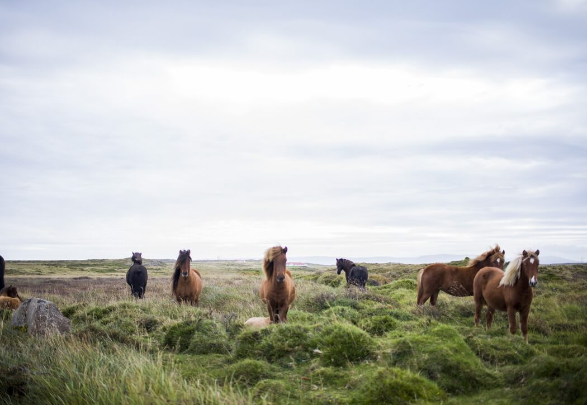

MobileScroll
=============

#### MobileScroll is a lightweight plugin to create a super simple slider with no features. The aim of this slider is to create a slider with high performance so that it can be used on mobile devices and build rich pages.

#### Why
Pages with tens of slider and hundreds of images can be too complex for a mobile device, especially if there is more than one plugin that act at the same time, and since the memory and CPU are not unlimited, in this circumstance could happen a browser crash.

This little plugin takes advantage of native scrolling with overflow scroll property applied to the image container, realizing in fact a fake gallery that doesn't use any complex and super featured plugin.

NB: The plugin works also on the desktop, but I recommend the usage just on mobile while you can rely on another powerful plugin on the desktop.

#### Use
Include:

    <link href="mobileScroll.css" rel="stylesheet">
    
html:

    

	    <a href="#" class="arrow arrow-prev" data-arrow="prev">prev</a>
	    <a href="#" class="arrow arrow-next" data-arrow="next">next</a>

        

    		
    
    			

    			

    			

    			

    		

    	

    

Initialize plugin:

    $(document).ready(function(){
	    $('.mobile-scroll').mobileScroll();
    })

#### Options:
    $(document).ready(function(){
	    $('.mobile-scroll').mobileScroll({
	        glimpse:    0,
			maxwidth:   768,
			height:     400,
			speed:      200
	    });
    })
##### maxwidth
Default: 768 - Max width of the slider. Is usefull set a maxwidth to avoid recalcs on tablet between portrait view and landscape view. 768px is iPad's width in portrait, this means that the slides have same size also in landscape view.

##### height
Default: 400 - Height of the slider in pixels.

##### speed
Default: 200 - Animation speed in milliseconds.

##### glimpse
Default: 0 - Glimpse size of nearby frames in pixels.

#### Demo:
http://davidecalignano.it/project/?mobile-scroll
